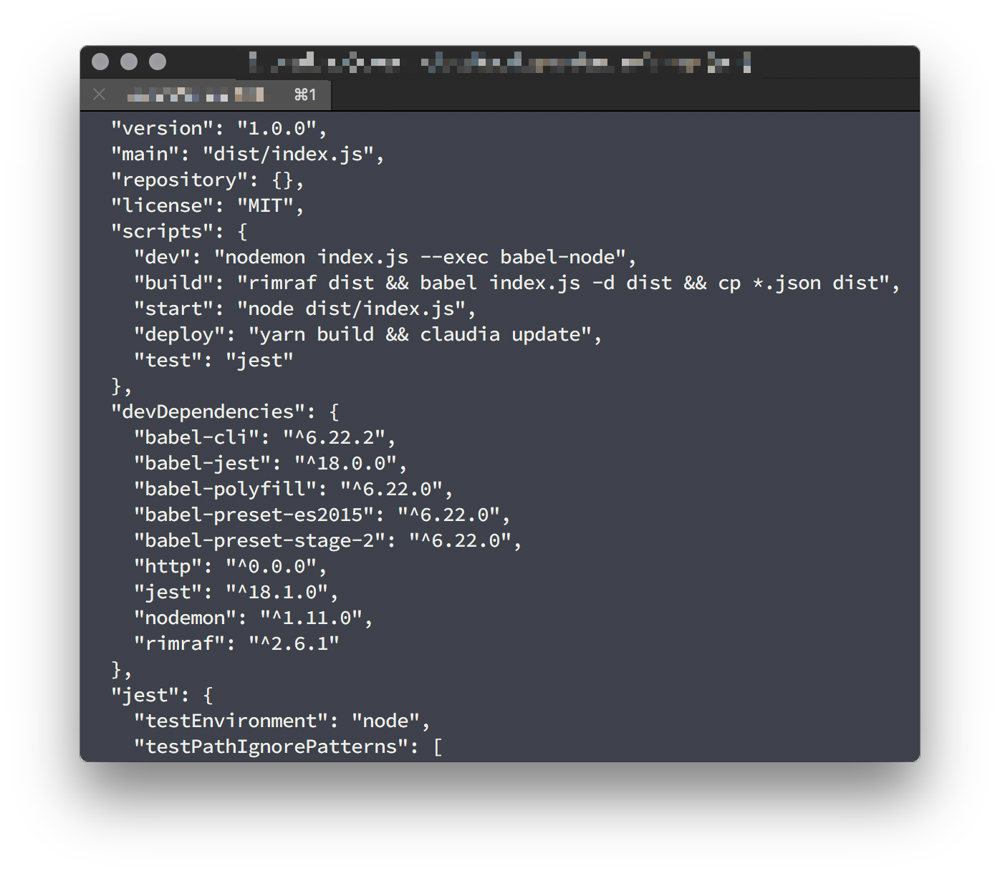

# Package.json scripts for Touchbar

> Displays package.json scripts in touchbar, a fork of [iam4x touchbar](https://github.com/iam4x/zsh-iterm-touchbar).

_WARNING!_ You must not have any keys binded to function in order for this script to work as it overwrites F1-F24.




### Requirements

- iTerm2 3.1.beta.3 (OS 10.10+) - [Download](https://www.iterm2.com/downloads.html)
- [zsh](http://www.zsh.org/) shell

### Installing plugin

Clone the repo in your plugins directory:

- `$ cd ${ZSH_CUSTOM1:-$ZSH/custom}/plugins`
- `$ git clone https://github.com/ChristopherNeuwirth/pkgjson-iterm-touchbar`

Then add the plugin into your `~/.zshrc`:

```
plugins=(... pkgjson-iterm-touchbar)
```

### Configuring for NPM instead of yarn

In `pkgjson-iterm-touchbar.plugin.zsh`, modify useYarn to `true` on line 6 if you want to use it instead of npm.
